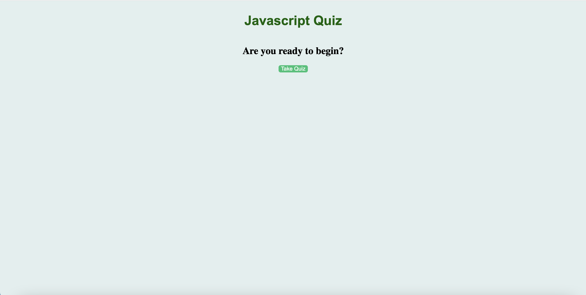

# Javascript Quiz

## Description

This project was to create a short multiple choice quiz that is also timed. By creating this quiz, I had to leverage my knowledge of Web APIs to create a more interactive application. I also reinforced my knowledge of javascript by creating quiz questions and answers that could be used on a future technical interview. The page cycles through a few multiple choice questions and gives the user 30 seconds to complete. If they get an answer wrong, the time left decreases by 5 seconds. Once they finish all the questions, or if the time runs out, they can enter their initials to save their score. Scores are displayed below.

[Link To Page](https://asreedy82.github.io/javascript-quiz-challenge/)

## Installation

N/A

## Usage

Upon loading the page, there is a button to start the quiz. This kicks off the 30 second timer, which can be seen in the top right of the screen. Then the first question loads. Make your selection and continue through each question until you finish them all or time has run out. Every question answered incorretly deducts 5s from the timer. Upon completion, enter your initials to save your score.

## Credits

N/A

## License

N/A

### Author: Anthony Reedy